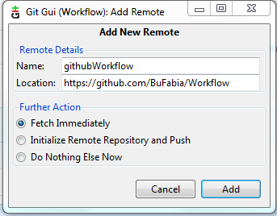
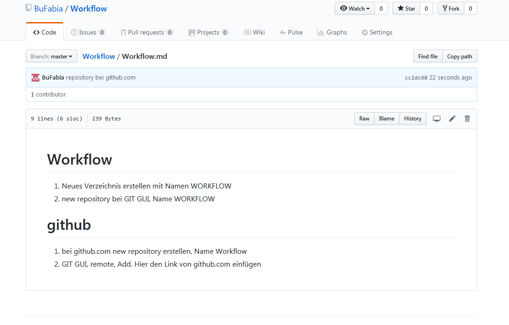

# Workflow

1. Neues Verzeichnis erstellen mit Namen WORKFLOW
1. new repository bei GIT GUI, Name WORKFLOW

# github.com

1. bei github.com new repository erstellen, Name Workflow
1. GIT GUI, remote, Add. Hier den Link von github.com einfügen
1. Um MD-File auf github.com zu importieren, muss man bei GIT GUI auf push drücken, nachdem man rescan, stage changed, sign off und commit durchlaufen hat

# Bild und Link

* ACHTUNG: Endung JPG oder PNG muss gross sein, damit es auf github angezeigt werden kann

